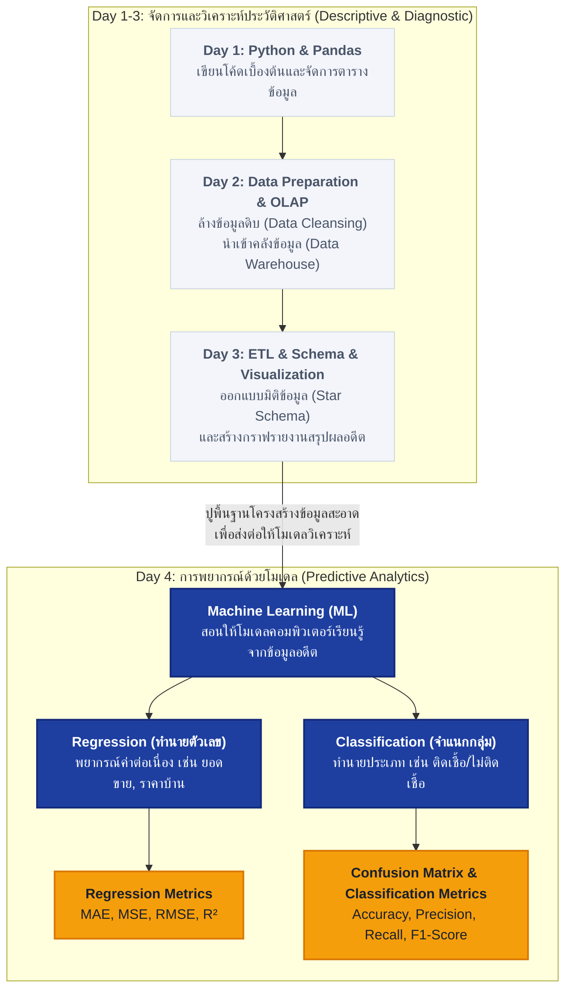

# คู่มืออธิบายเนื้อหา Day 4: สรุปฉบับเข้าใจง่ายที่สุด 🧠✨

หากคุณรู้สึกว่าเนื้อหาของ **Day 4 (Machine Learning & Metrics)** ดูเข้าใจยากและเต็มไปด้วยสูตรคณิตศาสตร์ นั่นเป็นเรื่องปกติมากครับ! เพราะในวันก่อนหน้านี้ (Day 1-3) จะเน้นเรื่องการจัดการโครงสร้างข้อมูลดิบและการสรุปผลแบบดั้งเดิม แต่ใน **Day 4** นี้คือจุดเปลี่ยนสำคัญที่จะยกระดับจากการดูอดีตไปสู่การ **"ทำนายอนาคต"**

เรามาดูแผนภาพภาพรวมและความเชื่อมโยง รวมถึงคำอธิบายเนื้อหาแต่ละส่วนด้วยภาษาที่เข้าใจง่ายกันครับ

---

## 🗺️ แผนภาพเชื่อมโยงเนื้อหา: จาก Day 1 ถึง Day 4

เพื่อให้เห็นภาพว่าปูพื้นฐานมาจากวันไหนและเกี่ยวข้องกันอย่างไร:

*   **Day 1 (รากฐาน)**: สอนการใช้ **Pandas DataFrame** เพื่อจัดรูปแบบตาราง
*   **Day 2 & 3 (คลังข้อมูลและการรายงาน)**: ปูเรื่องการแปลงข้อมูลและการทำความสะอาดข้อมูลดิบ เพราะโมเดลปัญญาประดิษฐ์ (ML) ใน **Day 4** จะฉลาดได้ก็ต่อเมื่อได้รับข้อมูลอดีตที่ **สะอาดและจัดโครงสร้างไว้ดีแล้ว** เท่านั้นครับ (ขยะเข้า = ขยะออก หรือ Garbage In, Garbage Out)

---

## 1. Machine Learning (ML) เบื้องต้น 🤖

เมื่อก่อนเราต้องการให้คอมพิวเตอร์ทำงาน เราต้องเขียนเงื่อนไขทีละข้อ (เช่น `if-else`) แต่ **Machine Learning** คือการนำ **ข้อมูลอดีต** มาร่วมกับ **เฉลย** ป้อนเข้าคอมพิวเตอร์ เพื่อให้คอมพิวเตอร์ค้นหา "สมการหรือกฎเกณฑ์" ออกมาเอง

ในชุดการเรียนรู้นี้เน้น **Supervised Learning (การเรียนรู้แบบมีผู้สอน)** ซึ่งมีโจทย์หลัก 2 แบบ:
1.  **Regression (การถดถอย)**: ทำนายผลลัพธ์ที่เป็น **ตัวเลขต่อเนื่องเชิงปริมาณ** เช่น ยอดขายพรุ่งนี้, อุณหภูมิ, ราคาหุ้น
2.  **Classification (การจำแนกประเภท)**: ทำนายผลลัพธ์ที่เป็น **กลุ่มหรือหมวดหมู่ขาดออกจากกัน** เช่น อีเมลนี้เป็นสแปมหรือไม่?, ลูกค้าคนนี้จะย้ายค่ายหรือไม่ (ใช่/ไม่ใช่), ภาพนี้คือหมาหรือแมว?

---

## 2. Linear Regression (การถดถอยเชิงเส้น) 📈

ใช้ทำนาย **ตัวเลขต่อเนื่อง** โดยหาความสัมพันธ์ระหว่างปัจจัยอิสระ $x$ (ตัวแปรต้น) กับผลลัพธ์ $y$ (ตัวแปรตาม) ออกมาเป็นสมการเส้นตรง:

$$\hat{y} = \beta_0 + \beta_1x$$

*   **$\hat{y}$ (y-hat)**: ค่าที่เราทำนายออกได้
*   **$\beta_0$ (Intercept / จุดตัดแกน Y)**: ค่าเริ่มต้นเมื่อ $x$ เป็น 0 (เช่น แม้ไม่โฆษณาเลย ก็ยังมียอดขายเริ่มต้นที่ $\beta_0$ ชิ้น)
*   **$\beta_1$ (Slope / ความชัน)**: อัตราการเพิ่มหรือลดของ $y$ ต่อหนึ่งหน่วยของ $x$ (เช่น หากลงทุนโฆษณาเพิ่ม 1 บาท ยอดขายจะขึ้น $\beta_1$ ชิ้น)

### Sum of Squared Errors (SSE) คืออะไร?
เมื่อเราลากเส้นตรงเพื่อทำนาย จุดข้อมูลจริง (สีแดง) จะไม่ได้อยู่บนเส้นตรงเป๊ะ ๆ ระยะห่างระหว่างจุดจริงกับเส้นทำนายเรียกว่า **ความคลาดเคลื่อน (Residual / Error)**
*   เพื่อไม่ให้ค่าบวกและค่าลบมาหักล้างกันเอง เราจึงจับมัน **ยกกำลังสอง**
*   **SSE** คือการเอาผลรวมความคลาดเคลื่อนยกกำลังสองของทุกจุดมารวมกัน
*   **เป้าหมายสูงสุด**: โมเดลที่ดีที่สุดคือโมเดลที่ปรับความชันและจุดตัดแกน Y จนทำให้ค่า **SSE ต่ำที่สุด** (จุดจริงอยู่ใกล้เส้นทำนายมากที่สุด)

---

## 3. Logistic Regression (การถดถอยโลจิสติก) 🌀

แม้ว่าชื่อจะมีคำว่า "Regression" แต่โมเดลนี้ใช้สำหรับงาน **Classification (จำแนกกลุ่ม)** เช่น การทำนายว่าคนไข้จะเป็นโรคอ้วนหรือไม่ (ใช่=1, ไม่ใช่=0)

### ทำไมไม่ใช้ Linear Regression ธรรมดา?
เพราะสมการเส้นตรงธรรมดาจะทำนายผลลัพธ์ออกเป็นค่าใดก็ได้ตั้งแต่ลบอินฟินิตี้ถึงบวกอินฟินิตี้ แต่ในความเป็นจริง **โอกาสความเป็นไปได้ต้องอยู่ระหว่าง 0% ถึง 100% (0.0 ถึง 1.0) เสมอ**

### Sigmoid Function (S-Curve) มาช่วยอย่างไร?
โมเดลจะแปลงสมการเส้นตรง $z = \beta_0 + \beta_1x$ ผ่านฟังก์ชัน **Sigmoid** เพื่อบีบผลลัพธ์ให้อยู่ในรูปทรงของตัว S โค้งมน ซึ่งมีสเกลตั้งแต่ **0 ถึง 1** พอดี

$$P = \frac{1}{1 + e^{-z}}$$

*   **Decision Boundary (เกณฑ์ตัดสินใจ)**: โดยทั่วไปตั้งไว้ที่ **0.5 (50%)** 
    *   ถ้าโอกาสพยากรณ์ได้ตั้งแต่ `0.50 ขึ้นไป` $\rightarrow$ จัดเป็น **Class 1 (เป็นโรค)**
    *   ถ้าโอกาสพยากรณ์ได้ `ต่ำกว่า 0.50` $\rightarrow$ จัดเป็น **Class 0 (ปกติ)**

---

## 4. มาตรวัดประเมินผลตัวเลข (Regression Metrics) 📐

หลังจากโมเดลทำนายตัวเลขออกมาแล้ว เราจะรู้ได้อย่างไรว่าตัวไหนเดาได้แม่นที่สุด? จึงต้องมีดัชนีชี้วัดความต่างระหว่าง **ค่าจริง (Real)** กับ **ค่าทำนาย (Predicted)** ดังนี้:

### 1) MAE (Mean Absolute Error)
*   **วิธีคิด**: หาระยะห่างของแต่ละจุด ปลดเครื่องหมายลบทิ้งให้เป็นบวกทั้งหมด แล้วหาค่าเฉลี่ย
*   **จุดเด่น**: สะท้อนระยะห่างความเพี้ยนเฉลี่ยตามจริงที่เป็นหน่วยเดิม เข้าใจง่ายที่สุด และไม่สะทกสะท้านต่อข้อมูลที่เพี้ยนหลุดโลกเกินไป (Outliers)

### 2) MSE (Mean Squared Error)
*   **วิธีคิด**: หาระยะห่างของแต่ละจุด จับยกกำลังสองก่อน แล้วค่อยหาค่าเฉลี่ย
*   **จุดเด่น**: ยิ่งทายเพี้ยนมากเท่าไหร่ ความคลาดเคลื่อนจะถูกคูณทวีคูณเร่งขนาดแผลความผิดพลาดขึ้นมาเป็นร้อยเท่าพันเท่า ทำให้เราเห็นจุดบกพร่องที่ทายผิดรุนแรงชัดเจน แต่ข้อเสียคือหน่วยของผลลัพธ์จะถูกยกกำลังสองไปด้วย (เช่น บาทกำลังสอง) ทำให้คนทั่วไปเข้าใจยาก

### 3) RMSE (Root Mean Squared Error)
*   **วิธีคิด**: เอาค่า MSE มาถอดสแควร์รูท (รากที่สอง) เพื่อดึงหน่วยวัดกลับมาเป็นสเกลปกติของข้อมูลดิบ
*   **จุดเด่น**: นิยมใช้มากในระดับสากล เพราะให้ความสำคัญกับความผิดพลาดรุนแรง (เหมือน MSE) แต่เข้าใจง่ายเพราะหน่วยกลับมาเหมือนหน่วยตั้งต้น (เช่น ทายยอดขายเพี้ยนเฉลี่ย RMSE = 5 ชิ้น)

### 4) R-Squared ($R^2$)
*   **วิธีคิด**: เปรียบเทียบประสิทธิภาพของโมเดลเรากับ "โมเดลฐานเฉลี่ยกลาง"
*   **จุดเด่น**: มีค่าระหว่าง `0 ถึง 1` ยิ่งเข้าใกล้ 1 ยิ่งดี ตัวอย่างเช่น $R^2 = 0.8$ หมายความว่า **"ปัจจัยที่เราใส่เข้าไปอธิบายพฤติกรรมความผันผวนของข้อมูลผลลัพธ์ได้ถึง 80%"** (อีก 20% เป็นปัจจัยภายนอกหรือความคลาดเคลื่อนที่ยังอธิบายไม่ได้)

---

## 5. Confusion Matrix & ดัชนีจำแนกประเภท 📊

เมื่อต้องประเมินผลการจัดกลุ่ม (เช่น คัดกรองโรคระบาด) เราจะดูแค่เปอร์เซ็นต์ความถูกต้องเฉย ๆ ไม่ได้ เพราะกรณีคนเป็นโรคน้อยมาก ๆ ต่อให้ตอบว่า "ทุกคนปกติ" ก็ได้ความแม่นยำสูงแล้วแต่ไม่มีประโยชน์ทางการแพทย์

จึงต้องใช้ตาราง 4 ช่องนี้มาวิเคราะห์:

| ข้อมูลจริง \ ผลทายจาก AI | AI ทายว่าติดเชื้อ (Positive) | AI ทายว่าไม่ติดเชื้อ (Negative) |
| :--- | :---: | :---: |
| **ติดเชื้อจริง (Actual Positive)** | **True Positive (TP)** (ติดจริง & ทายถูก) | **False Negative (FN)** (ติดจริง & ทายว่าไม่ติด) *[อันตราย: หลุดตรวจ]* |
| **ไม่ติดจริง (Actual Negative)** | **False Positive (FP)** (ไม่ติด & ทายว่าติด) *[ตื่นตูมฟรี]* | **True Negative (TN)** (ไม่ติด & ทายว่าไม่ติด) |

### 🛠️ มาตรวัดที่คำนวณจากตาราง:
*   **Accuracy (ความแม่นยำรวม)**: อัตราส่วนการทายถูกทุกข้อเทียบกับจำนวนประชากรทั้งหมด $\rightarrow \frac{TP + TN}{Total}$
*   **Precision (ความแม่นยำเมื่อทายบวก)**: เมื่อ AI ทายว่าเป็นโรค มีความถูกต้องกี่เปอร์เซ็นต์ (เน้นลดโอกาสตื่นตูมฟรี/FP) $\rightarrow \frac{TP}{TP + FP}$
*   **Recall (ความสามารถในการตรวจจับ)**: จากคนป่วยทั้งหมดที่มีอยู่จริง AI สามารถตามจับมาเข้าระบบได้กี่เปอร์เซ็นต์ (เน้นลดโอกาสปล่อยคนป่วยหลุดรอดไปแพร่เชื้อ/FN) $\rightarrow \frac{TP}{TP + FN}$
*   **F1-Score**: ค่าเฉลี่ยแบบฮาร์มอนิกของ Precision และ Recall เป็นตัวแทนประเมินภาพรวมที่เหมาะสมเมื่อต้องการให้ทั้งสองค่านี้มีจุดสมดุลร่วมกันโดยไม่เอียงไปข้างใดข้างหนึ่ง
